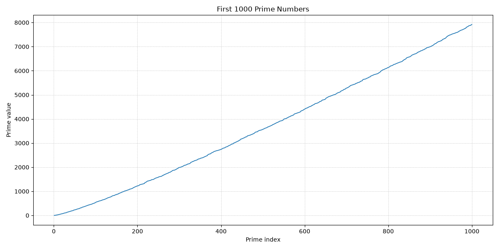

# First 1,000 Primes

This project generates and plots the first 1,000 prime numbers using Python and Matplotlib. It is managed with uv, so you get a local virtual environment, reproducible dependencies, and a simple command-line workflow.

## What is a prime number?

A prime number is a whole number greater than 1 that has exactly two positive divisors: 1 and itself.  
For example, 2, 3, 5, and 7 are prime numbers, while 4 is not because it can also be divided by 2.

Prime numbers are important in mathematics because they are the building blocks of all whole numbers (every integer greater than 1 can be written as a product of primes). They are also widely used in computer science and cryptography, where properties of prime numbers help secure digital communication.


## What it does

- Computes the first 1,000 prime numbers
- Plots the values on a line chart
- Saves the chart as `first_1000_primes.png`

## Project Files

- `first_1000_primes.py` - main script and plotting logic
- `pyproject.toml` - project metadata and dependencies
- `uv.lock` - locked dependency versions for reproducible installs
- `.gitignore` - excludes the virtual environment and generated files

## Requirements

- Python 3.10 or newer
- uv installed locally

## Setup

Clone the repository, then install the dependencies and create the virtual environment:

```bash
uv sync
```

That command creates a local `.venv` and installs Matplotlib from the locked dependency set.

## Run

Use the installed script entry point:

```bash
uv run first-1000-primes
```

Or run the module directly:

```bash
uv run python first_1000_primes.py
```

The script opens a chart window when running in an interactive environment and also saves the plot to `first_1000_primes.png`.

## Notes

- The generated image file is ignored by git so the repository stays clean.
- The script uses a headless-friendly backend check so it works both locally and in non-interactive environments.

## Example Output

After running the script, you should see a plot of prime values increasing as the prime index grows.

